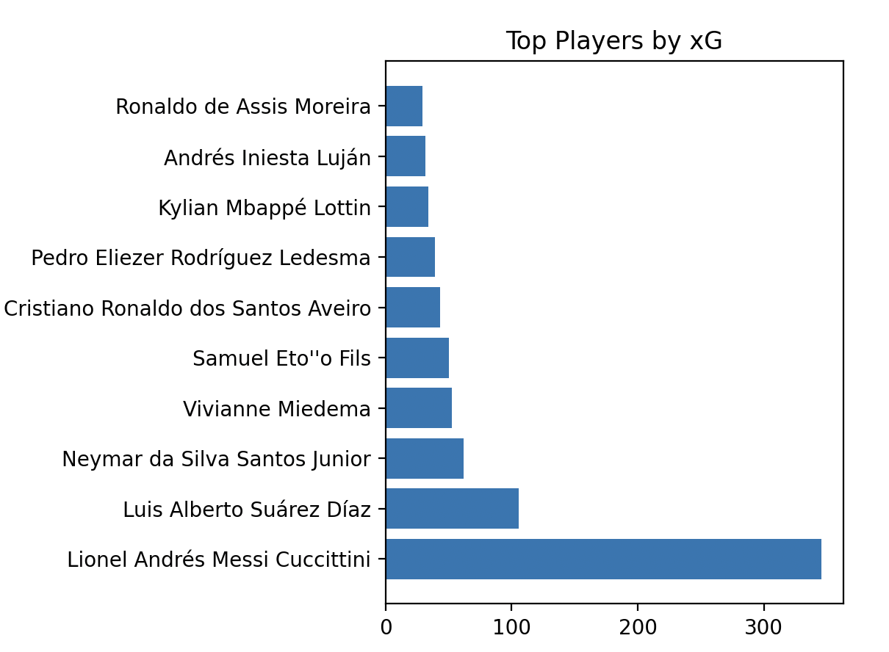
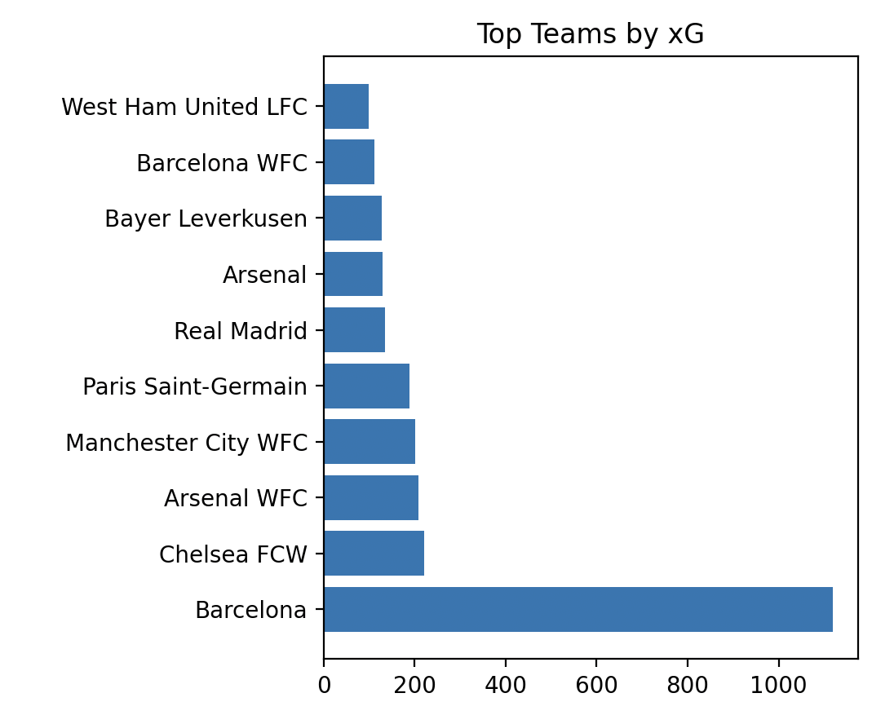
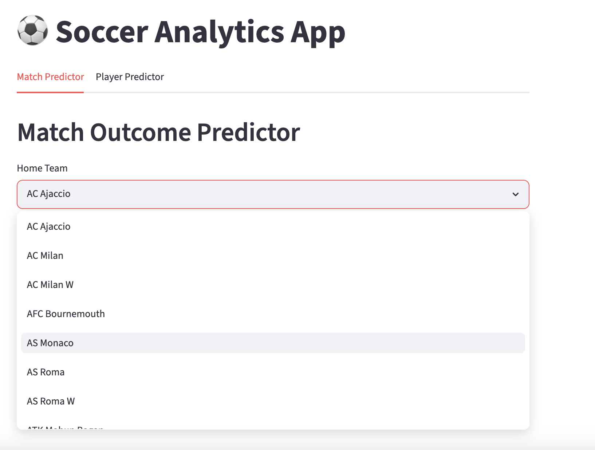
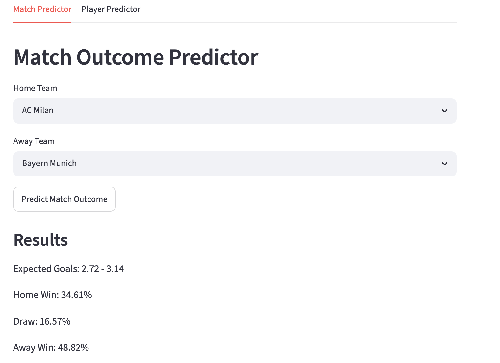

# Soccer Analytics: Expected Goals (xG) Prediction System

## Overview

This project builds an end-to-end soccer analytics system centered around Expected Goals (xG), using StatsBomb event data and machine learning (XGBoost) to estimate shot quality, simulate match outcomes, and predict player performance.

The system processes raw match event data, engineers shot-level features, trains a machine learning model, and generates player and team-level analytics based on predicted xG values.

The goal of the project is to demonstrate an end-to-end machine learning pipeline including:

- Data processing
- Feature engineering
- Predictive modeling
- Model evaluation
- Sports analytics applications

The final system allows users to:

- Predict the probability that any shot results in a goal
- Compare player finishing performance using xG vs goals
- Evaluate team attacking strength
- Simulate match outcomes between two teams via a command-line interface
- Predict player performance (expected goals and shots)
- Interactively explore analytics through a web application

---

## Key Features

### Shot-Level Expected Goals Modeling

Predicts the probability that a shot becomes a goal using features such as:

- Shot distance
- Shot angle
- Body part used
- Shot type
- Shot technique
- First-time shot indicator
- Defensive pressure
- Number of nearby defenders

### Player Analytics

Aggregates shot-level predictions to generate:

- Total xG
- Goals scored
- xG per shot
- Finishing performance
- Expected goals per match

### Team Analytics

Computes team-level metrics including:

- Total xG
- Goals scored
- Attack strength ratings
- Finishing efficiency

### Match Outcome Prediction

Simulates matches using team strength ratings and Poisson goal distributions to estimate:

- Expected goals for each team
- Home win probability
- Draw probability
- Away win probability

### Interactive Streamlit Dashboard

The project includes a Streamlit application that allows users to interact with the models through a web interface.

#### Match Predictor

Users can:

- Select a home team
- Select an away team
- Generate expected goals projections
- View win, draw, and loss probabilities

#### Player Goal Predictor

Users can:

- Select a player from the dataset
- Estimate expected goals per match
- Explore player scoring performance metrics
- Searchable Team and Player Selection

#### Usability

The dashboard uses searchable dropdown menus populated directly from the dataset to prevent invalid inputs and allow users to explore their options.

---

## Dataset

Data source:

https://github.com/statsbomb/open-data


There are 4235 matches/events included in this dataset. The dataset contains detailed event-level information, including:

- Shot locations
- Shot outcomes
- Body part used
- Shot type
- Technique
- Defensive positioning
- Freeze-frame player locations
- Pressure information

---

## Project Structure

```text
soccer-analytics/
│
├── data/
│   ├── processed/
│   ├── shot_predictions.csv
│   ├── player_xg.csv
│   ├── team_xg.csv
│   ├── team_ratings.csv
│   ├── player_xg.csv
│   ├── player_ratings.csv
│   └── matches.csv
│
├── models/
│   ├── xgboost_xg_model.pkl
│   └── features.pkl
│
├── notebooks/
│   ├── data_exploration.ipynb
│   └── feature_engineering.ipynb
│
├── src/
│   ├── feature_engineering.py
│   ├── build_dataset.py
│   ├── load_data.py
│   ├── train_model.py
│   ├── xg_tables.py
│   ├── team_ratings.py
│   ├── match_dataset.py
│   ├── match_predictor.py
│   ├── run_match_predictor.py
│   ├── player_ratings.py
│   ├── player_predictor.py
│   ├── run_player_predictor.py
│   └── app/py
|
├── img/
│   ├── player_xg_ex.png
│   ├── SB_logo.png
│   └── team_xg_ex.png
│
└── README.md
```

---

## Feature Engineering

For each shot (108281 in total across all 4235 events), the following features are extracted:

### Shot Geometry

- Distance from goal
- Shooting angle

### Shot Characteristics

#### Body Part

- Left Foot
- Right Foot
- Head
- Other

#### Shot Type

- Open Play
- Penalty
- Free Kick
- Corner

#### Technique

- Normal
- Volley
- Half Volley
- Backheel
- Lob
- Other

### Contextual Features

- First-time shot indicator
- Under-pressure indicator
- Number of nearby defenders within a 5 unit radius (freeze-frame data)

### Target Variable

```text
goal = 1
not goal = 0
```

---

## Model

The project uses XGBoost because of its strong performance on tabular datasets and ability to model nonlinear relationships between shot characteristics. Prior to using this model, preliminary testing included usage of a logisitic regression, but was later changed due to reasons stated above. With changes to the XGBoost model, accuracy increased from 0.78 to 0.80. 

### Hyperparameters

```python
XGBClassifier(
    n_estimators=200,
    max_depth=4,
    learning_rate=0.05,
    subsample=0.8,
    colsample_bytree=0.8,
    random_state=42
)
```

---

## Model Performance

| Metric | Value |
|----------|----------|
| ROC-AUC | 0.80 |

---

## Outputs

### Shot-Level Predictions

`shot_predictions.csv`

Contains:

- Match ID
- Team
- Player
- Actual outcome
- Shot characteristics
- Predicted xG

### Player Analytics

`player_xg.csv`

Contains:

- Player name
- Player team
- Predicted xG
- Goals scored
- Total shots
- Goals minus xG

Used to identify:

- High performing finishers
- Low performing finishers
- High-volume shooters

Example: Top 10 players by xG


### Team Analytics

`team_xg.csv`

Contains:

- Team name
- Team xG
- Team goals
- Team shots
- Goals minus xG

Used to evaluate:

- Attacking quality
- Finishing efficiency
- Team performance trends

Example: Top 10 teams by xG


---

## Technologies Used

- Python
- Pandas
- NumPy
- Scikit-learn
- XGBoost
- Matplotlib
- Jupyter Notebook
- Streamlit

---

## How to Run

### Feature Engineering

```bash
python src/feature_engineering.py
```

### Building Dataset for Model

```bash
python src/build_dataset.py
```

### Loading Data 

```bash
python src/load_data.py
```

### Training Model

```bash
python src/train_model.py
```

### Create Player and Team Predictions

```bash
python src/xg_tables.py
```

### Get Match Predictions

```bash
python src/match_dataset.py

python src/team_ratings.py

python src/match_predictor.py

python src/run_match_predictor.py
```

### Get Player Predictions

```bash
pythom src/player_ratings.py

python src/player_predictor.py

python src/run_player_predictor.py

```

## Opening Web Application

```bash
streamlit run src/app/app.py
```

---

## Match and Player Performance Prediction (Interactive CLI Tool) -- REMOVED FOR WEB APPLICATION, BUT CODE NEEDED IS STILL IN THE FILE (COMMENTED OUT)

The project includes an interactive command-line tool that allows users to input any two teams and receive match predictions powered by the trained xG model and team strength ratings. It also allow the user to input any player name and returns predicted performance in terms of expected goals and shots.

### Running the Predictor

```bash
python src/run_match_predictor.py
```

You will be prompted to enter:

```text
Enter home team: [your choice of home team]
Enter away team: [your choice of away team]
``'

or,

```text
Enter player name: [your choice of player]
```

---

## How It Works

For match outcome:

1. Loads precomputed team strength ratings from `team_ratings.csv`
2. Retrieves attack strength for both teams
3. Estimates expected goals using learned team strengths
4. Simulates match outcomes using a Poisson model
5. Home team has an added 30% boost to account for home stadium advantage
6. Outputs:
   - Expected goals (xG) for both teams
   - Win / Draw / Loss probabilities

For player perfomance:
1. Load precomputed player ratings from `player_ratings.csv`
2. Estimates expected goals using learned player strengths

---

## How the App Looks

### Dropdown Menu



### Example of Match Prediction Output



## Future Improvements

### Additional Features

- Goalkeeper position
- Nearest defender
- Match state
- Timestamp

### Model Parameters

- Hyperparamter tuning
- Cross-validation

### Visualization

- Potential interactive streamlit dashboard
- Player comparison dashboards

---

## Author

**Katherine Li**